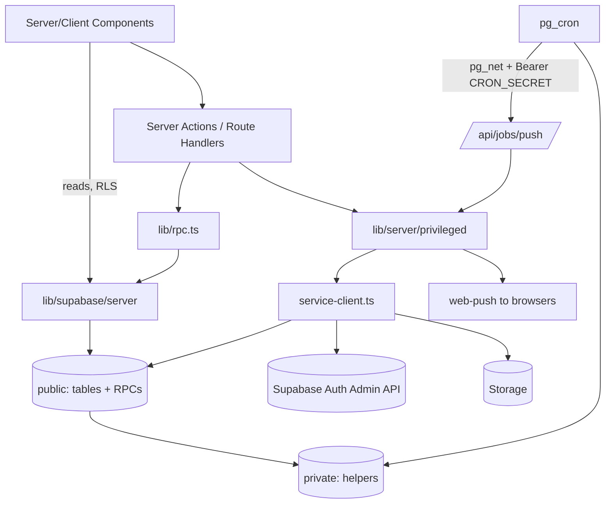
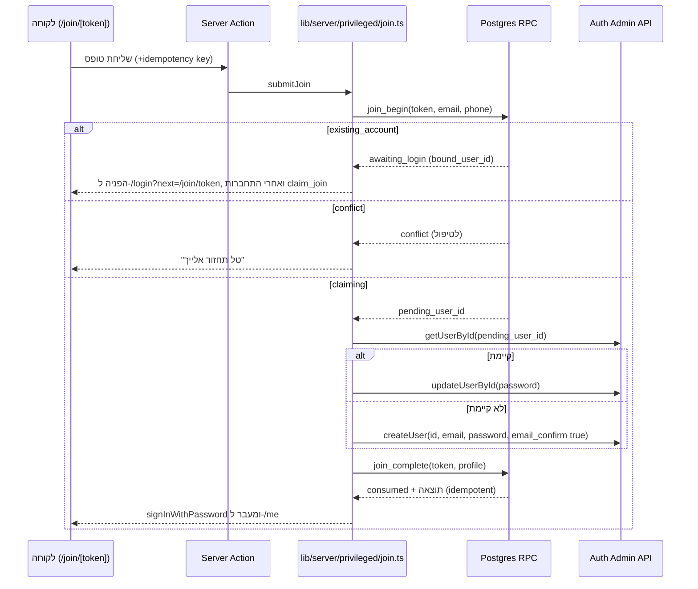
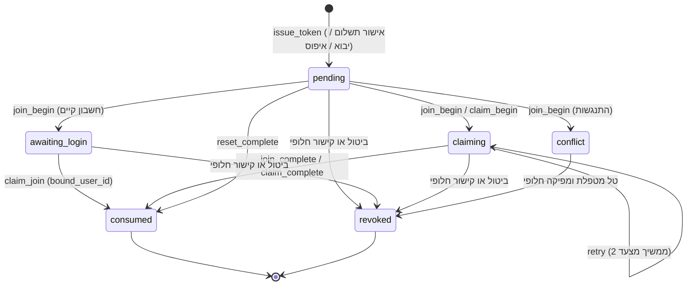
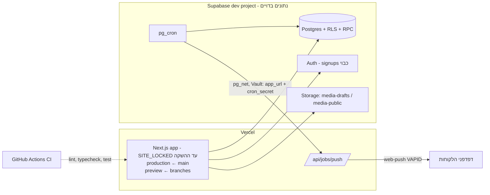

# Architecture Spine: בראנץ׳ אצל טל

> מסמך המקור `brunch_at_tal_charecter.md` גובר על המסמך הזה בכל סתירה. המסמך קובע רק מה שסשנים נפרדים עלולים לבנות בצורה לא עקבית. הכללים העסקיים עצמם נמצאים ב-SPEC. ב-AGENTS.md נמצאים הכללים שחלים בכל סשן, והם לא חוזרים כאן. ‏`data-model.md` הוא הצעה, והמסמך הזה מתקן אותו במקומות שמסומנים (AD-3, ‏AD-5, ‏AD-8, ‏AD-10, ‏AD-12, ‏AD-14, ‏AD-18, ‏AD-19, ‏AD-20, ‏AD-23).

## Design Paradigm

**ליבה עסקית במסד (transaction script ב-Postgres), ו-Next.js כמתאם דק.** כל פעולה עסקית שמשנה נתונים היא פונקציית plpgsql אחת שרצה בעסקה אחת. Next.js לא מחליט דבר עסקי. הוא קורא דרך RLS, מפעיל RPC ומציג.

| שכבה | איפה | תפקיד |
| --- | --- | --- |
| הצגה | `app/**/page.tsx`, `components/**` | Server Components קוראים. Client Components רק לאינטראקציה |
| מתאם | `app/**/actions.ts` (Server Actions), `app/api/**/route.ts` | אימות קלט בסיסי ← RPC ← מיפוי תוצאה או קוד שגיאה |
| גישה | `lib/rpc.ts`, `lib/supabase/{client,server,public,proxy}.ts` | קריאות RPC עם טיפוסים, לקוחות Supabase עם RLS |
| הרשאה מוגברת | `lib/server/privileged/**` | הקוד היחיד שמחזיק את לקוח ה-service role |
| ליבה | `supabase/migrations/**` ← schema `public` (טבלאות ו-RPC חשופים), schema `private` (עזרים וטבלאות פנימיות) | כללים, נעילות, יומן, התראות |
| רקע | pg_cron ← `private.job_*`, ‏pg_cron ← pg_net ← `/api/jobs/push` | משימות מתוזמנות ושליחת פוש |



כיוון התלות הוא חוק, ו-ESLint אוכף אותו (Consistency Conventions › אכיפה). חץ הפוך אסור. Client Component לא מייבא את `lib/server/**`. ‏`private` לא חשוף ב-API.

## Invariants & Rules

### AD-1: כל שינוי עסקי הוא RPC אחד בעסקה אחת [ADOPTED]

- **Binds:** CAP-2, CAP-3, CAP-4, CAP-5, CAP-6, CAP-9, CAP-10, CAP-11, CAP-12, CAP-13, CAP-14, CAP-15, CAP-16, CAP-17, CAP-18, CAP-19, CAP-20, CAP-25, CAP-26, CAP-27, CAP-29, CAP-30, CAP-31, CAP-32, CAP-34, CAP-36, CAP-37, CAP-38, CAP-39, CAP-40, CAP-41
- **Prevents:** בדיקה אחת ב-TS ובדיקה אחרת ב-SQL, פעולה שמורכבת מכמה קריאות לא אטומיות, ושני סשנים שכותבים את אותו כלל פעמיים.
- **Rule:** כל פעולה מהרשימה ב-`security-and-rpc-rules.md › פונקציות שרת`, וכל כתיבה של אדמין (כולל הערות פנימיות ושורות `media_assets`), מתבצעת ב-RPC אחד ב-`public`. ה-RPC מבצע בדיקה, נעילה, שינוי, יומן (`private.audit`, ‏AD-19) והכנסת התראה לתור (`private.enqueue_notification`, ‏AD-12) באותה עסקה. Server Action מבצע RPC עסקי אחד לכל היותר. החריגים היחידים הם הפעולות הדו-שלביות של AD-21. ל-`authenticated` אין הרשאת `insert/update/delete` על אף טבלה, חוץ מעדכון עצמי של `profiles` (רק `full_name`, ‏`dietary_notes`) ושל `babies`, בהרשאות לפי רשימת עמודות (AD-5). מנויי פוש, סימון התראות כנקראו ואישור השימוש בתמונות (`set_photo_consent`, שרושם מועד, גרסת נוסח ויומן — CAP-40) עוברים RPC.

### AD-2: שלוש מעטפות, מפת נתיבים קבועה, כתובות באנגלית [ADOPTED]

- **Binds:** CAP-1, CAP-4, CAP-7, CAP-8, CAP-12, CAP-24, CAP-25, CAP-27, CAP-29, CAP-33, EXPERIENCE › Information Architecture
- **Prevents:** נתיב אחד לאותו מסך בשני סשנים, ניווט שמורכב פעמיים, ואזור אישי או אדמין שנבנים מחוץ למעטפת.
- **Rule:** הנתיבים הם אלה שב-*Structural Seed*. כתובות באנגלית, `<title>` וכותרות בעברית. ‏`app/me/layout.tsx` דורש לקוחה עם פרופיל פעיל (`get_my_session_role()` מחזיר `customer`), ו-`app/admin/(shell)/layout.tsx` דורש `admin`. אחרת הם מפנים ל-`/login?next=…` או ל-`/admin/login?next=…`. בדיקת התפקיד רצה בתוך רכיב שעטוף ב-`<Suspense>` (דרישה של `cacheComponents`, ‏AD-16). ההגנה ב-layout היא נוחות בלבד. ההרשאה האמיתית היא RLS ובדיקה בתוך ה-RPC. כניסת אדמין בנתיב נפרד, ‏`/admin/login` (מקור §3), מחוץ למעטפת האדמין, עם אותו רכיב טופס כמו `/login`. עמוד מפגש קיים ב-`/sessions/[id]` (אורחת) וב-`/me/sessions/[id]` (לקוחה), ושניהם מרנדרים את אותו רכיב מ-`components/shared/`. מסך חדש נוסף תחת אחת המעטפות בלבד. באדמין, שתי תצוגות של אותו דבר הן נתיבים אחים ולא state בדף: `sessions/[id]` (פרטים) ו-`sessions/[id]/work` (דף העבודה, CAP-38), ‏`customers` ו-`customers/open-cards` (CAP-42). מרכז ההתראות של טל הוא `/admin/notifications`, ונפתח מהפעמון בסרגל העליון של המעטפת (CAP-35).

### AD-3: זהות, `profiles.id = auth.users.id`, וחיפוש זהות אחד

- **Binds:** CAP-4, CAP-5, CAP-7, CAP-8, CAP-25, CAP-30, CAP-31
- **Prevents:** שתי דרכים לתרגם משתמשת Auth ללקוחה, ושלוש בדיקות כפילות שונות (הצטרפות, יבוא ושינוי פרטים) שלא רואות לקוחה מיובאת שעוד לא הופעלה.
- **Rule:**
  - המפתח של `profiles` הוא מזהה משתמשת ה-Auth. אין עמודת `auth_user_id` (מתקן את data-model). בהצטרפות: `pending_user_id` (AD-10). ביבוא: הפרופיל נוצר קודם, וההפעלה יוצרת את משתמשת ה-Auth עם `id = profiles.id`. ‏`customer_id` בכל טבלה מפנה ל-`profiles.id`. אין FK מ-`profiles` ל-`auth.users`, כדי שהסרת פרטים תוכל למחוק את משתמשת ה-Auth.
  - הקוראת נגזרת רק דרך `private.current_customer_id()`: ‏`auth.uid()` כשיש לו פרופיל עם `activated_at` ובלי `anonymized_at`, אחרת `null`. כל RPC של לקוחה זורק `NOT_AUTHORIZED` כשהערך `null`. לכן משתמשת Auth בלי פרופיל פעיל לא יכולה לבצע כלום. אדמין מזוהה רק לפי `admin_roles`, דרך `private.is_admin()`.
  - המייל נמצא רק ב-`auth.users.email`. החריג היחיד: `profiles.pending_email` ללקוחה מיובאת שעוד לא הופעלה, שמתאפס כשמשתמשת ה-Auth נוצרת. אדמין קוראת מייל רק דרך `admin_list_customers` ו-`admin_get_customer`, שהן definer ומצטרפות ל-`auth.users` (לא דרך Admin API ולא דרך עמודת מראה).
  - חיפוש זהות אחד: `private.find_identity(p_email, p_phone)` מנרמל מייל (`lower(trim())`) וטלפון (`private.normalize_phone`), ובודק מול `auth.users.email`, ‏`profiles.phone_e164` ו-`profiles.pending_email`. משתמשים בו `join_begin`, יבוא, `admin_change_email`, ‏`admin_change_phone` וחיפוש לקוחה קיימת. תוצאות: אין התאמה; חשבון אחד (במייל, או בטלפון בלבד, בלי לחשוף באיזה שדה); שני חשבונות שונים (`conflict`); התאמה לפרופיל מיובא שלא הופעל (`conflict` לטל, כי הלקוחה צריכה להפעיל דרך קישור ה-claim שלה).

### AD-4: גבול הלקוח המוגבר (service role)

- **Binds:** CAP-4, CAP-7, CAP-22, CAP-27, CAP-30, CAP-31
- **Prevents:** שימוש ב-`SUPABASE_SECRET_KEY` "כי זה יותר קל" בקריאות אדמין רגילות, וכך עקיפת RLS ודליפה לדפדפן.
- **Rule:** ‏`createServiceClient` עובר מ-`lib/supabase/server.ts` ל-`lib/server/privileged/service-client.ts`, וכל קובץ תחת `lib/server/privileged/` מתחיל ב-`import "server-only"`. ESLint חוסם ייבוא שלו מכל מקום אחר. שימושים מותרים בלבד: Auth Admin API לכתיבה (יצירה, סיסמה, מייל, מחיקה), העתקה ומחיקה ב-Storage בין buckets (AD-16), RPC שמורשות ל-`service_role` בלבד, ועובד הפוש. אסור לקרוא נתוני לקוחות דרך ה-Admin API. כל קריאה ושאר הכתיבות של אדמין עוברות דרך הלקוח הרגיל, עם RLS ו-`private.is_admin()`.

### AD-5: חוזה RPC, הרשאות ו-idempotency

- **Binds:** כל RPC, כל טבלה, כל migration
- **Prevents:** RPC שנועדה ל-service role וזמינה לכל לקוחה, שמות וצורות שגיאה שונים בכל סשן, ו-retry שמבצע פעמיים.
- **Rule:**
  - **שם:** `snake_case`, פועל ואז שם עצם (`book_session`, ‏`cancel_booking`, ‏`move_booking`). פעולת אדמין: `admin_<verb>_<noun>`. תצוגה מקדימה: `preview_<same name>`. עזרים: `private.<name>`, משימות: `private.job_<name>`. פרמטרים: `p_<name>`.
  - **הרשאות:** migration ‏`0001` מבטל את הרשאות ברירת המחדל של Supabase: ‏`alter default privileges in schema public revoke execute on functions from public, anon, authenticated` ו-`revoke all on tables from anon, authenticated`. את אותו דבר הוא עושה ל-`private`, ובנוסף `revoke all on schema private from public` ו-`grant usage on schema private to authenticated`. ה-schema ‏`private` לא נוסף ל-exposed schemas. אותו ביטול חל גם על `service_role` (טבלאות, sequences ופונקציות), כי Supabase מפסיקה לתת grants אוטומטיים לטבלאות חדשות (בפרויקט חדש מ-30.05.2026, בפרויקט קיים מ-30.10.2026), ופרויקט הפרודקשן יתנהג אחרת מ-dev. כל grant, גם ל-`service_role`, מפורש. ‏`grants.test.ts` בודק גם את `service_role` ואת `pg_default_acl`.
  - **פונקציה:** כל migration של פונקציה מסתיימת ב-`revoke execute … from public, anon, authenticated, service_role`, ואחריו `grant execute` אחד בדיוק: ל-`authenticated` **או** ל-`service_role`. אף פעם לא לשניהם, ואף פעם לא ל-`anon`. ב-`private` רק עזרים שנקראים מ-policy או מ-view (`is_admin`, ‏`current_customer_id`) מקבלים `execute` ל-`authenticated`. הם `security definer stable`, בלי ארגומנטים. RPC ב-`public` הוא `security definer` עם `set search_path = ''`. השורה הראשונה בודקת הרשאה. RPC של service role בודק `(select auth.role()) = 'service_role'`.
  - **Security advisor:** ‏RPC ב-`public` שהוא `security definer` וקיבל `grant` ל-`authenticated` מקפיץ תמיד WARN ‏`0029` (`authenticated_security_definer_function_executable`). זה מכוון ומאושר, בתנאי שה-RPC מקיים את כל כללי הפונקציה שלמעלה. כל WARN או ERROR אחר חוסם. RPC שלא ניגש לטבלאות בעצמו, אלא רק קורא לעזרי `private` שהם definer (למשל `get_my_session_role`), הוא `security invoker`, ולכן לא מקפיץ את האזהרה.
  - **טבלה:** ‏`revoke all … from anon, authenticated`, ואז רק מה שה-policy צריכה: `select` לכל הטבלה, ו-`insert`/`update` רק לפי רשימת עמודות. ‏`supabase/tests/grants.test.ts` בודק את `routine_privileges` ו-`role_table_grants`, ונכשל על כל חריגה.
  - **שגיאה:** `raise exception '<CODE>' using errcode = 'P0001', detail = <json>`. ‏`<CODE>` הוא קוד יציב באנגלית באותיות גדולות. קוד חדש נוסף ל-`lib/errors.ts` באותו commit, יחד עם המפתחות של `detail` שלו. אין טקסט בעברית ב-SQL, חוץ מתבניות התראה שבטבלה.
  - **הצלחה:** ‏`jsonb` עם שדות `snake_case`.
  - **Idempotency:** כל RPC שמשנה נתונים מקבל `p_idempotency_key uuid`. טבלה אחת, `private.idempotency_results(actor_scope text, rpc text, key uuid, request_hash text, result jsonb, created_at)`, עם מפתח ראשי `(actor_scope, rpc, key)`. ‏`actor_scope` הוא `auth.uid()` אצל `authenticated`, ואצל service role נושא מפורש (`token:<id>`), אף פעם לא `null`. ‏`private.idempotent_begin` היא הפקודה הראשונה אחרי בדיקת ההרשאה, לפני כל נעילה. היא מכניסה שורה בלי תוצאה, כך שקריאה מקבילה עם אותו מפתח ממתינה, ומחזירה תוצאה שמורה אם יש כזאת. אם אותו מפתח מגיע עם `request_hash` שונה, היא זורקת `IDEMPOTENCY_KEY_REUSED`. כשל לא נשמר. מפתח אחד שייך לקריאת RPC אחת. בחירה מרובה בכרטיסייה עוברת ב-`book_sessions(p_items, p_idempotency_key)`, שמחזירה תוצאה לכל תאריך. אין עמודת `idempotency_key` באף טבלה אחרת, כך ש-`payments.idempotency_key` יוצא מ-data-model. תשלום מקוון (סבב הסליקה) לא עובר ב-`idempotency_results`: ההגנה היחידה מכפילות היא האינדקס הייחודי `(provider, provider_transaction_id)` יחד עם `pg_advisory_xact_lock` על המפתח, והתוצאה החוזרת נבנית מהשורות (AD-10). סידור רשימה באדמין הוא `admin_set_<noun>_order(p_ids uuid[])` עם הרשימה המלאה, שנדחה ב-`CONCURRENT_CHANGE` כשהרשימה לא זהה לקיימת, ופטור כמו `set_*`.
  - **פטורים מ-idempotency:** RPC של קריאה, סימון נקראו, מנויי פוש, עדכון פרופיל עצמי, ‏`claim_push_jobs`/`finish_push_job`, רענון פנימי אידמפוטנטי (`private.refresh_credit_options`), ו-RPC מסוג `set_*` שקובע ערך מוחלט (סימון בוצע במשימה, בפריט קניות או בפתק, נעיצה, ארכיון, `set_photo_consent`). RPC שיוצר שורה (מנה, משימה, פריט, פתק, נושא, קונספט) מקבל מפתח.
  - **מתאם:** Server Action מחזיר תמיד `{ ok: true, data } | { ok: false, code }`. ‏`lib/errors.ts` הוא המקום היחיד שממפה `code` למיקרו-קופי. קוד לא מוכר מוצג כשגיאת שרת כללית.

### AD-6: סדר נעילה מלא, יומן והתראה בתוך העסקה [ADOPTED]

- **Binds:** CAP-9, CAP-10, CAP-11, CAP-12, CAP-13, CAP-14, CAP-16, CAP-17, CAP-18, CAP-19, CAP-20, CAP-26
- **Prevents:** ‏deadlock בין `cancel_booking` שנועל הרשמה ואז מפגש לבין `admin_cancel_event` שנועל מפגש ואז הרשמות, ושתי הרשמות היכרות מקבילות של אותה לקוחה.
- **Rule:** סדר נעילה גלובלי, ובתוך טבלה לפי `id` עולה: `activation_tokens` ← `profiles` ← `events` ← `bookings` ← `entitlements` ← `cancellation_credits` ← `credit_options` ← `payments` ← `refund_requests` ← `waitlist_entries` ← `notification_jobs`. שורת `profiles` של הלקוחה היא ה-mutex שלה, וכל RPC שקורא ואז כותב הרשמות, זכויות, זיכויים, המתנה או החזרים של לקוחה נועל אותה. לעולם לא נועלים ילד כדי לגלות את ההורה. קוראים את מזהה ההורה בלי נעילה, נועלים את ההורה, נועלים את הילד ובודקים שוב (אחרת `CONCURRENT_CHANGE`). משימות רקע נועלות ב-`order by id … for update skip locked` באותו סדר. אינווריאנטים (הרשמה פעילה אחת ללקוחה במפגש, המתנה פעילה אחת, זכות היכרות פעילה אחת, הרשמת היכרות פעילה אחת) מגובים גם ב-unique index חלקי. ספירת מקומות היא סכום `party_size` של הרשמות `confirmed`, בלי מונה שמור. אין קריאת רשת מתוך עסקה. **ספירת מקומות:** רק `private.occupied_places(p_event_id)` סוכמת `party_size`. אף SQL אחר (RPC, view, בדיקת תפוסה באדמין) לא סוכם הרשמות, ובדיקה סורקת את `pg_proc.prosrc` ואת הגדרות ה-views. "הרשמה אמיתית" (תזכורות, סיום מפגש, דף עבודה, רשימות נרשמות) מוגדרת פעם אחת ב-`private.is_real_booking` (`confirmed` או `completed`). **RPC מורכב** לוקח את כל הנעילות שלו בתחילתו, בסדר הגלובלי, לפני כל `plan_*` או `*_core`. פונקציות `*_core` מניחות שהנעילות כבר קיימות ורק בודקות שוב. **אינווריאנט בין שורות בלי שורת הורה** (למשל "לפחות אמצעי תשלום גלוי אחד") מוגן ב-`pg_advisory_xact_lock(hashtext('<table>'))`, לפני כל נעילת שורה.

### AD-7: פעולה רגישה, תכנון אחד ל-preview ולביצוע

- **Binds:** CAP-3, CAP-9, CAP-10, CAP-11, CAP-12, CAP-17, CAP-18, CAP-19, CAP-30, CAP-31, CAP-32, CAP-34
- **Prevents:** השפעה שמוצגת בחלון האישור ושונה ממה שמתבצע, ‏preview שחושף רשימת נרשמות ללקוחה, ופעולה רגישה שמתבצעת בלי אישור.
- **Rule:** לכל פעולה ברשימה הרגישה (SPEC › Constraints, כולל תיקון בזכות, תיקון "השתתפה בעבר", שינוי חלופות זיכוי ואישור יבוא) יש `private.plan_<name>(…) returns jsonb` אחת, שמחשבת גם את מה שמוצג וגם את מה שמתבצע. ‏`preview_<name>` היא בדיקת הרשאה ואחריה `return private.plan_<name>(…)`. ‏`<name>` היא בדיקת הרשאה, idempotency, נעילות, ‏`plan_<name>` ואז ביצוע. היא מקבלת `p_confirmed boolean` וזורקת `CONFIRM_REQUIRED` כשהוא לא `true`. ל-preview יש בדיוק אותה בדיקת הרשאה ואותו grant כמו לפעולה, ובדיקה מוודאת שלקוחה שקוראת ל-`preview_admin_*` מקבלת `NOT_AUTHORIZED`. בביטול או בשינוי מפגש ובהודעה כללית, ה-preview מחזיר את הנוסח המרונדר מהתבנית, טל עורכת אותו, והפעולה מקבלת אותו ב-`p_message`. ‏`lib/admin/sensitive-actions.ts` מגדיר פעם אחת את הרשימה ואת נוסח השאלה, ו-`components/admin/sensitive-confirm-dialog.tsx` הוא הרכיב היחיד שמציג אותן. שינוי ערך שאינו רגיש עובר דרך `components/admin/value-change-row.tsx`, בלי `p_confirmed`. באישור תשלום, ‏`private.plan_approve_payment` מחשב את מה שמוצג לפני האישור (זכות, כניסות, תפוגה, מפגש, `price_changed`), ו-`admin_approve_payment` דורש `p_confirmed` רק כש-`price_changed`.

### AD-8: הזמן מחושב במסד בלבד [ADOPTED]

- **Binds:** CAP-2, CAP-4, CAP-9, CAP-13, CAP-14, CAP-16, CAP-18, CAP-21, CAP-24, CAP-28
- **Prevents:** מועד סגירה או גבול 48 שעות שמחושבים ב-JS לפי שעון הדפדפן או בלי שעון קיץ, ומתגלים כשונים מהשרת.
- **Rule:**
  - כל מועד עסקי מחושב ב-SQL בעזרי `private` עם `'Asia/Jerusalem'`: `local_day_end(date)`, ‏`registration_closes_at(starts_at, rule)`, ‏`cancel_deadline(confirmed_policy, starts_at)`, ‏`local_week_start(date)` (יום ראשון המקומי, להארכה אוטומטית), ‏`prep_day(starts_at, offset)` (ימי ההכנה בדף העבודה). תפוגה של מוצר מוצמד = `local_day_end` של יום המפגש. העזרים האלה פונקציות טהורות של הקלט שלהן, כדי שבדיקות יוכלו לבדוק בדיוק 48 שעות ושעון קיץ. השעון הוא `now()` של המסד.
  - `events.registration_closes_at` נשמר. יש לו דגל `registration_close_overridden`, ו-trigger מחשב אותו מחדש כששעת המפגש משתנה, אלא אם טל קבעה אותו ידנית.
  - RPC של קריאה מחזיר את המועדים המחושבים ואת ההחלטות (`cancel_deadline`, ‏`can_self_cancel`, ‏`registration_open`), ו-TS רק מציג אותם. ‏`lib/time.ts` מכיל רק עיצוב (`Intl`, ‏`he-IL`, ‏`timeZone: 'Asia/Jerusalem'`, ‏`<time datetime>`) וגיל תינוק לתצוגה. ‏`Date.now()` לא משמש להחלטה עסקית.

### AD-9: כסף ומספרי טלפון [ADOPTED]

- **Binds:** CAP-2, CAP-3, CAP-5, CAP-6, CAP-11, CAP-19, CAP-24, CAP-25
- **Prevents:** ‏`128.00` שהופך ל-`127.99999`, סכום שנשמר פעם בשקלים ופעם באגורות, ושני נרמולי טלפון שונים.
- **Rule:** סכום עובר בכל שכבה כ-integer באגורות, בשם שמסתיים ב-`_agorot`. ‏`lib/money.ts` הוא המקום היחיד שמעצב (`formatAgorot`) ומפרק קלט (`parseShekelsToAgorot`, בלי `parseFloat`). כל סכום מחושב (הסכום בבית האדמין, בסיס כספי לזיכוי, תקרת החזר) נוצר ב-SQL. נרמול טלפון ל-E.164 נעשה רק ב-`private.normalize_phone`. בטופס יש רק בדיקת פורמט רכה.

### AD-10: קישורים חד-פעמיים ויצירת חשבון [ADOPTED]

- **Binds:** CAP-2, CAP-4, CAP-5, CAP-6, CAP-7, CAP-10, CAP-29, CAP-31, CAP-34, CAP-37
- **Prevents:** חשבון Auth כפול אחרי retry, קישור שנצרך בלי שיוך, קישור גולמי שנשמר במסד, קישור שמשייך רכישה או יתרה לחשבון זר, ואיפוס סיסמה שעוקף את תהליך האיפוס.
- **Rule:**
  - **טוקן:** נוצר רק ב-SQL, ב-`private.issue_token(p_purpose, …)`: ‏32 בייט מ-`gen_random_bytes`, ב-base64url בלי ריפוד. במסד נשמר `token_hash = encode(digest(raw,'sha256'),'hex')`. החיפוש רק דרך `private.find_token(p_raw)`. שום קוד TS לא מגבב טוקן, ושום RPC לא מקבל גיבוב. הטוקן הגולמי מוחזר פעם אחת בלבד, בתשובה של ה-RPC שהנפיק אותו, ו-`idempotent_finish` שומר את התוצאה בלעדיו. קריאה חוזרת מחזירה `reissue_required`. במסך הקישורים אין "העתקה" מאוחרת, רק סטטוס ו"הפקת קישור חלופי", שמעביר את הקודם ל-`revoked` באותה עסקה. תוקף של 48 שעות, קבוע ב-SQL.
  - **מצבים:** `pending`, ‏`awaiting_login`, ‏`claiming`, ‏`consumed`, ‏`revoked`, ‏`conflict`. ‏`expired` נגזר (`now() > expires_at` ו-`state in (pending, awaiting_login)`) ולא נשמר. ‏`claiming` שהתחיל לפני התפוגה רשאי להסתיים.
  - **ליבת אישור אחת (חוזה):** ‏`private.approve_payment_core(p_source, p_actor_id, p_actor_kind, p_customer_id, p_product_id, p_event_id, p_amount_agorot, p_amount_override_reason, p_paid_on, p_payment_method_id, p_reference, p_note, p_provider, p_provider_transaction_id, p_on_seat_failure)`, עם החתימה הסופית כבר ב-E2. היא הקוד היחיד שיוצר שורת `payments`, ואת הזכות ואת ההרשמה המוצמדת שנגזרות ממנה (היוצרים האחרים של זכויות וטוקנים הם רק היבוא ו-`admin_issue_link`, דרך `private.issue_token`). היא בנויה משלושה צעדים פרטיים: `private.record_payment`, ‏`private.grant_from_payment`, ‏`private.place_pinned_booking`. היא לא בודקת קוראת ולא קוראת `auth.uid()`, ‏`auth.role()` או `private.is_admin()`: המבצעת עוברת כפרמטר, ו-`private.audit` מקבלת אותה כפרמטר (AD-19). מצב ההרשמה נגזר מהמקור: `manual` ← `admin`, ‏`online` ← `online` (AD-18). ‏`p_on_seat_failure`: ‏`raise` ב-manual (הכול מתגלגל אחורה), ‏`park` ב-online (התשלום והזכות נשמרים בלי הרשמה, ו"שולם בלי מקום" מופיע ב"לטיפול"). ‏`park` נבנה ונבדק כבר עכשיו. הליבה לא מנפיקה טוקן, ומחזירה `payment_id`. מוצר מוצמד בלי `p_event_id` ← `PINNED_EVENT_REQUIRED`. מפגש במוצר ימים ← `EVENT_NOT_ALLOWED`. עד E3, כל מוצר מוצמד ← `PINNED_NOT_AVAILABLE`. ל-`entitlements` יש check: מוצמד ⇔ `pinned_event_id` מלא. שינוי חתימה של פונקציה הוא `drop` ואחריו `create` באותה migration, ו-`grants.test.ts` נכשל כשיש שתי פונקציות באותו שם.
  - **המעטפת של טל:** ‏`admin_approve_payment` משרתת גם לקוחה חדשה (CAP-2) וגם קיימת (CAP-6): בדיקת אדמין, idempotency, נעילות בסדר הגלובלי (`profiles` של לקוחה קיימת ← `events` של מוצר מוצמד), ואז הליבה עם `source = manual` ו-`raise`. ללקוחה חדשה (`p_customer_id` ריק) היא קוראת באותה עסקה ל-`private.issue_token('join', payment_id)` ומחזירה את הטוקן הגולמי פעם אחת. לכל תשלום יש לכל היותר טוקן `join` אחד שלא בוטל (אינדקס ייחודי חלקי). ללקוחה קיימת השורות משויכות מיד, והתראת `purchase_repeat` נכנסת לתור (discriminator = `payment_id`). ‏`preview_admin_approve_payment` מחזירה את `private.plan_approve_payment` (AD-7). אין RPC אחר שמכניס ל-`payments`. ‏`payments.status = voided` שמור: בגרסה הראשונה אין פעולה שקובעת אותו.
  - **עמודות התשלום:** ‏`check ((source = 'manual') = (recorded_by is not null))`, ‏`check ((source = 'manual') = (payment_method_id is not null))`, ‏`check ((source = 'online') = (provider is not null and provider_transaction_id is not null))`. ל-`source` אין ברירת מחדל. אינדקס ייחודי חלקי `(provider, provider_transaction_id) where provider_transaction_id is not null`. ‏`product_snapshot` כולל `payment_method_name`, וכל תצוגה או ייצוא של תשלום עבר קוראים את השם ממנו. ה-join ל-`payment_methods` משמש רק לסינון. סכום הבית (CAP-24) נסכם מ-`payments` במצב `approved`, בלי join לאמצעי. בטבלת `payment_methods` אין שורה שמייצגת תשלום מקוון.
  - **אמצעי תשלום:** "ניתן לבחירה" = `hidden = false`, ומוגדר פעם אחת ב-`private.payment_method_selectable(id)`. הליבה דוחה ב-manual אמצעי שאינו ניתן לבחירה (`PAYMENT_METHOD_NOT_SELECTABLE`). הכתיבה רק ב-`admin_add_payment_method`, ‏`admin_rename_payment_method`, ‏`admin_hide_payment_method`, ‏`admin_show_payment_method`, ‏`admin_delete_payment_method` (רק כשאין תשלום שמפנה אליו, אחרת `PAYMENT_METHOD_IN_USE`. ה-FK הוא `on delete restrict`) ו-`admin_set_payment_method_order(p_ids)`. כל RPC שמקטין את הרשימה הגלויה לוקח קודם `pg_advisory_xact_lock(hashtext('payment_methods'))`, וזורק `LAST_PAYMENT_METHOD` אם לא יישאר אמצעי גלוי (AD-6).
  - **שיוך רכישה:** רק ב-`private.bind_purchase(p_payment_id, p_customer_id)`, שנקראת מ-`join_complete`, מ-`claim_join` ומ-`claim_complete` (ובעתיד מהמסלול המקוון). אחרי נעילת `profiles` של הלקוחה היא בודקת שוב כל אינווריאנט שלא נבדק כש-`customer_id` היה ריק: הרשמה פעילה אחת במפגש, המתנה פעילה לאותו מפגש, זכות והרשמת היכרות פעילה אחת, ו-`intro_only` רק אם `not has_participated`. בהפרה לא משויך כלום, הטוקן עובר ל-`conflict` עם `conflict_reason`, ומוחזר `BIND_CONFLICT` (מופיע ב"לטיפול"). אף שגיאת unique גולמית (23505) לא יוצאת מ-RPC של שיוך. אחרת היא ממלאת `customer_id` בכל שורה שנגזרת מהתשלום: `payments`, ‏`entitlements`, ‏`bookings` (לפי `payment_id`), ‏`cancellation_credits` (לפי `source_entitlement_id` או `origin_booking_id`) ו-`refund_requests` (לפי `payment_id`). אחר כך היא מכניסה לתור את ההתראות שדולגו כשלא הייתה לקוחה (`purchase_new_card`, ‏`event_cancelled`, ‏`event_changed`, ‏`booking_cancelled`), עם ה-discriminator הרגיל, כך ששום דבר לא נשלח פעמיים. ‏`supabase/tests/bind-purchase.test.ts` עובר על כל טבלה עם עמודת `customer_id`, ונכשל על טבלה שלא מטופלת ואינה ברשימת "לא נוצר לפני שיוך". RPC שהיה יוצר שורה של לקוחה לרכישה לא משויכת, ולא יכול לגזור אותה מהתשלום, זורק `PURCHASE_NOT_BOUND`.
  - **הצטרפות (`purpose = join`),** מתוזמרת ב-`lib/server/privileged/join.ts`:
    1. `join_begin(p_token, p_email, p_phone)` (service role) נועל את הטוקן וקורא ל-`find_identity`. ‏`existing_account` ← ‏`state = awaiting_login` עם `bound_user_id`. ‏`conflict` ← ‏`state = conflict`, שמופיע ב"לטיפול". אחרת ← ‏`state = claiming` עם `pending_user_id` חדש ו-`input_hash = sha256(email|phone)`. קלט אחר במצב `claiming` או `awaiting_login` נבדק מחדש, עד 3 בדיקות זהות לקישור (`identity_attempts`), ואחר כך `conflict` (`too_many_attempts`). משתמשת Auth יתומה של `pending_user_id` נמחקת קודם בשרת (החלטת משתמשת 2026-10-03, סיפור 2.4).
    2. `getUserById(pending_user_id)`: אם היא קיימת ← `updateUserById` לסיסמה (רק במצב `claiming` עם אותו id ובלי פרופיל מופעל). אם לא ← `createUser({ id, email, password, email_confirm: true })`. ‏`email_exists` כשה-id לא קיים משאיר את הקישור ב-`claiming`, פתוח לתיקון הקלט.
    3. `join_complete(p_token, p_profile)` בעסקה אחת: פרופיל עם `activated_at`, תינוקות, הסכמה עם הגרסה המפורסמת הנוכחית של המדיניות (נקראת בשרת), אישור התמונות (לא חובה) עם הגרסה המפורסמת של נוסח הבקשה (CAP-40), שיוך דרך `private.bind_purchase`, ‏`consumed` ויומן (התראת הרכישה נכנסת לתור בתוך `private.bind_purchase`). קריאה חוזרת מחזירה את אותה תוצאה.
    4. `signInWithPassword` בשרת ואז `/me`.
  - **חשבון קיים:** הפניה ל-`/login?next=/join/<token>`. אחרי ההתחברות, `claim_join(p_token)` (‏`authenticated`) מצליח רק כש-`purpose = join`, ‏`state = awaiting_login`, ‏`bound_user_id = auth.uid()` והטוקן לא פג. אחרת `NOT_AUTHORIZED` בלי פרטים. השיוך עובר דרך `private.bind_purchase`, ובהתנגשות הטוקן עובר ל-`conflict`.
  - **הפעלה ליבוא (`claim`) ואיפוס (`reset`)** עוברים רק דרך המתזמר המוגבר, עם RPC של service role (`claim_begin`/`claim_complete`, ‏`reset_begin`/`reset_complete`). אף RPC של `authenticated` לא מקבל טוקן שאינו `join`. ‏claim יוצר את משתמשת ה-Auth עם `id = profiles.id` ורושם הסכמה. ‏`admin_issue_link(purpose => 'claim')` נדחה לפרופיל שכבר הופעל (`ALREADY_ACTIVATED`, וטל משתמשת ב-reset).
  - **תצוגה:** `/join/[token]` ו-`/reset/[token]` קוראים דרך `join.ts#getTokenView` ← ‏`token_view(p_token)` (service role). הוא מחזיר רק `{state_public, purpose, product_name, amount_agorot, expires_on}`, ומייל מוסתר ב-claim. פתיחה לא משנה מצב.
  - **תקוע:** טוקן `claiming` יותר מ-15 דקות מופיע ב"לטיפול", וכניסה חוזרת לאותו קישור ממשיכה מצעד 2.

### AD-11: מנגנון התזמון הוא pg_cron [ADOPTED]

- **Binds:** CAP-9, CAP-15, CAP-18, CAP-21, CAP-22, CAP-28, CAP-35, CAP-36
- **Prevents:** מתזמן שונה לכל פיצ'ר (Vercel cron, ‏setTimeout, קריאה מהדפדפן), משימה שלא רצה כשאין דפדפן פתוח, ותזכורת "ל-09:00" שמגיעה ב-10:00 אחרי מעבר לשעון קיץ.
- **Rule:** כל משימה נרשמת ב-migration עם `cron.schedule('<job_name>', …)` ומריצה פונקציית `private.job_<name>()` אחת, שבטוחה להרצה כפולה. אין Vercel Cron (בתוכנית Hobby הוא רץ רק פעם ביום). ‏pg_cron רץ ב-UTC, ולכן **אף משימה לא נשענת על שעת ה-cron**: משימה שקשורה לשעה או ליום מקומיים רצה בתדירות גבוהה, מחשבת ב-SQL לפי `Asia/Jerusalem` אם הגיע הזמן, ונמנעת מכפילות לפי מפתח (חלון זמן, שבוע או תאריך תפוגה). תדירות ה-cron קובעת רק את העיכוב המרבי.

  | משימה | תדירות | מה עושה |
  | --- | --- | --- |
  | `job_reminders` | כל דקה | AD-13 |
  | `job_invoke_push_worker` | כל דקה | `net.http_post` ל-`<app_url>/api/jobs/push`, עם `Authorization: Bearer <cron_secret>` מ-Vault ו-`timeout_milliseconds := 10000` (ברירת המחדל של pg_net היא 2000), דרך עזר אחד `private.invoke_push_worker`. העובד מגדיר `maxDuration = 60`. בלי ערכים ב-Vault, לא עושה כלום |
  | `job_complete_events` | כל 5 דקות | מפגש שהסתיים ← `completed`, הרשמות ← `completed`, והוספת תנועות `use` (AD-14) |
  | `job_refresh_credit_options` | כל 15 דקות | השלמה והחלפה של חלופות זיכוי (בנוסף לקריאה מתוך RPC) |
  | `job_marketing_reminders` | כל 5 דקות | לכל מועד בלוח שב-`business_settings.marketing_reminder_schedule` שהגיע (שעון ישראל) ועוד לא נשלח: בוחר את הנוסח הפעיל עם `last_sent_at` הישן ביותר, מעדכן אותו, ומכניס `marketing_reminder` לכל אדמין (discriminator = תאריך ושעת המועד) |
  | `job_expiry_alerts` | כל שעה | כרטיסייה עם כניסות פנויות (`entitlement_balances`) שהגיעה לסף טל או לסף הלקוחה ב-`business_settings`: ‏`admin_card_expiring` לכל אדמין ו-`card_expiring` ללקוחה (discriminator = `entitlement_id:expires_on`, כך שהארכה מאפשרת התראה חדשה) |
  | `job_auto_extend` | כל שעה | לכל שבוע מקומי שהסתיים (`local_week_start`) וחופף לתוקף של כרטיסייה, בלי מפגש `published` שהכרטיסייה מתאימה לו (`private.week_has_eligible_session`): ‏`entitlement_corrections` עם actor מערכת ו-`week_start` ייחודי לזכות, ‏`expires_on + 7`, יומן והתראת `entitlement_changed`, באותה עסקה (CAP-36). שבוע שנוסף בהארכה נבדק בהרצה שאחריו |
  | `job_cleanup` | יומי | התראות שנקראו לפני 90 יום, משימות שהסתיימו לפני 30 יום, ‏`idempotency_results` בני יותר מ-7 ימים, ‏`cron.job_run_details` ישנים (`net._http_response` נמחק לבד אחרי 6 שעות) |

  **העובד:** ‏`app/api/jobs/push/route.ts` מקבל רק `POST` ומשווה Bearer עם `crypto.timingSafeEqual`. בלי `CRON_SECRET` ב-env הוא מחזיר 503, ובסוד שגוי 401. ‏`CRON_SECRET` מוגדר רק בסביבת Vercel שה-`app_url` ב-Vault מצביע עליה.

### AD-12: התראות ותור הפוש [ADOPTED]

- **Binds:** CAP-6, CAP-9, CAP-12, CAP-13, CAP-15, CAP-17, CAP-21, CAP-22, CAP-32, CAP-35, CAP-36
- **Prevents:** נוסח שמורכב ב-TS, התראה שנבלעת בגלל מפתח זהה, שני שמות לאותו סוג, retry ששולח שוב למכשיר שכבר קיבל, משימה שנתקעת ב-`sending`, ומערכת התראות שנייה לאדמין עם עובד ומנויים משלה.
- **Rule:**
  - **נמענת (החלטת משתמשת):** טבלה אחת לכולן. ‏`notifications.recipient_id` = מזהה משתמשת Auth (ללקוחה זה `profiles.id`, AD-3; לאדמין `admin_roles.user_id`), ‏`recipient_kind in ('customer','admin')`. ‏`push_subscriptions.user_id` באותו אופן. התראת אדמין נוצרת לכל אדמין בנפרד. RLS: ‏`recipient_id = (select auth.uid())`. אין טבלת `admin_notifications` (מתקן את data-model).
  - **סוגים:** רשימה סגורה (`check`) שמוגדרת פעם אחת, שורה לכל שורה ב-notification-matrix: `purchase_new_card, purchase_repeat, booking_confirmed, reminder, waitlist_spot, booking_cancelled, event_changed, event_cancelled, entitlement_changed, card_expiring, broadcast` (ללקוחה) ו-`admin_card_expiring, marketing_reminder` (לאדמין). הערוצים והנמענת לכל סוג קבועים באותה טבלה.
  - **יצירה:** נקודת כניסה אחת: `private.enqueue_notification(p_recipient_id, p_type, p_discriminator, p_vars, p_target_path, p_body_override default null)`, ועוטפת `private.enqueue_admin_notification(p_type, …)` שקוראת לה לכל אדמין. הנמענת חובה. היא מרנדרת מ-`notification_templates` (או לוקחת את `p_body_override` ב-`event_changed`, ‏`event_cancelled`, ‏`broadcast` ו-`marketing_reminder`), שומרת את הנוסח ב-`notifications.payload`, ויוצרת `notification_jobs` לסוגים עם פוש.
  - **מפתח:** `dedupe_key = type:recipient_id:discriminator`, ייחודי, ו-`on conflict do nothing`. ה-discriminator קבוע לכל סוג: `reminder` ← ‏`booking_id:revision`; ‏`event_changed`/`event_cancelled` ← ‏`event_id:revision`; ‏`waitlist_spot` ← ‏`event_id:<party_size>:<cycle>`; ‏`broadcast` ← ‏`broadcast_id`; ‏`card_expiring`/`admin_card_expiring` ← ‏`entitlement_id:expires_on`; ‏`marketing_reminder` ← תאריך ושעת המועד המקומיים; ושאר הסוגים ← מזהה השורה שה-RPC יצר (`booking_id`, ‏`payment_id`, ‏`entitlement_corrections.id`, ‏`audit_log.id` של הביטול).
  - **`events.revision`:** עולה רק ב-trigger, ורק כשמשתנים `starts_at`, ‏`ends_at`, ‏`kind`, או `status` ל-`cancelled`. אף RPC לא כותב אותו.
  - **העובד:** `claim_push_jobs(p_limit)` מסמן `sending` עם `lease_until = now() + 2 דקות`, ולוקח גם משימות `sending` שה-lease שלהן עבר. משימה אחת להתראה. העובד שולח לכל המנויים הפעילים של הלקוחה, ורושם `notification_deliveries(job_id, subscription_id)` ייחודי, כך ש-retry מדלג על מי שכבר קיבלה. ‏404 או 410 מוחקים מנוי. ‏401 ו-403 לא מוחקים. כשל זמני מתוזמן מחדש ב-backoff. אחרי מספר הניסיונות המקסימלי המשימה עוברת ל-`failed` ומופיעה ב"לטיפול". משימת `waitlist_spot` נבדקת שוב לפני שליחה (עדיין יש מקום וההרשמה פתוחה), ואם לא, היא נסגרת בלי שליחה.
  - **מנויים:** נכתבים רק ב-`register_push_subscription(p_endpoint, p_keys, p_platform)`, שמוחקת את אותו endpoint מכל לקוחה אחרת, וב-`unregister_push_subscription` בהתנתקות. זוג VAPID אחד לכל פרויקט Supabase, זהה בכל סביבת Vercel שמחוברת אליו. ‏`target_path` חייב להתחיל ב-`/me` בסוג של לקוחה וב-`/admin` בסוג של אדמין (`check`). העובד שולח למנויים של `recipient_id`, בלי קשר לסוג. ‏`VAPID_SUBJECT` הוא `mailto:` של העסק (Apple דוחה ערך לא תקין ב-403, ו-403 לא מוחק מנוי).
  - **נקרא:** רק `mark_notifications_read(p_ids default null)`, שמסמנת `read_at = now()`. כשל פוש אף פעם לא משנה הרשמה.

### AD-13: תזכורות נגזרות מהמצב [ADOPTED]

- **Binds:** CAP-12, CAP-16, CAP-20, CAP-21, CAP-34
- **Prevents:** משימת תזכורת ישנה שנשארת אחרי ביטול, הזזה או שינוי שעה.
- **Rule:** אין משימות תזכורת מתוזמנות מראש. ‏`private.job_reminders` בוחר הרשמות `confirmed` עם `customer_id is not null` (AD-23) שבהן `now() >= starts_at - lead`, ‏`now() < starts_at` ו-`confirmed_at < starts_at - lead`, כש-`lead` נלקח מ-`bookings.policy_snapshot`. לכל אחת הוא קורא ל-`enqueue_notification(…, 'reminder', booking_id || ':' || revision, …)`. תיקון תיאור או צילום לא משנה revision (AD-12) ולכן לא שולח שוב. שינוי שעה משנה revision, ולכן מחשב את התזכורת מחדש.

### AD-14: מצב נגזר, יומן תנועות וזמינות

- **Binds:** CAP-9, CAP-10, CAP-12, CAP-13, CAP-15, CAP-18, CAP-24, CAP-28
- **Prevents:** יתרה, תפוסה, פקיעה או סטטוס פעילות שנשמרים ומתיישנים, יומן תנועות שכל סשן מסכם בסימן אחר, ו-view שעוקף RLS.
- **Rule:**
  - **יומן תנועות:** `entitlement_movements` הוא append-only. אין הרשאת `update/delete`, ו-trigger זורק שגיאה. ‏`units` עם סימן קבוע לכל פעולה (`check`): ‏`grant`, ‏`opening_balance` ו-`release` חיוביים; ‏`reserve` שלילי; ‏`use` = 0 עם `booking_id` (מסמן שהשריון נוצל); ‏`adjust` ≠ 0. סיום מפגש מוסיף `use` ולא עורך `reserve`. הנוסחה של "זמינות" ו"משוריינות" כתובה פעם אחת, ב-view‏ `entitlement_balances`.
  - **Views:** כל view ב-`public` נוצר `with (security_invoker = true)`. נתון שחוצה לקוחות מגיע רק מפונקציות definer. **ללקוחה:** `get_event_availability(p_event_ids)` (‏`authenticated` בלבד, לא `anon`) מחזירה לכל מפגש `published` רק תווית לפי גודל ההרשמה של הלקוחה — `available`, ‏`last_places` (מקומות פנויים ≤ `business_settings.last_places_threshold`) או `full` — ואת `registration_open`. אף פעם לא מספר. **לאורחת:** אין נתון תפוסה בכלל (CAP-1). **לאדמין:** מספרים רק דרך `admin_*`. בדיקת ה-advisor נקייה.
  - **כרטיסיות פתוחות (CAP-42):** `admin_list_open_cards(p_filter)` נגזרת מ-`entitlement_balances` ומ-`booking_allocations`: כרטיסייה שלא פגה ושיש בה כניסות שלא נוצלו (משוריינת ≠ נוצלה), ולכל כניסה ההרשמה שמימנה אותה או "פנויה". אין טבלה שמורה. סף "עומדת לפוג" נקרא מ-`business_settings` בזמן הקריאה (תצוגה בלבד).
  - **פקיעה ופעילות:** `entitlements.status` שומר רק מצבים שאדמין קבעה (`active`, ‏`revoked`, ‏`refunded`). "פגה" ו"נוצלה" נגזרות ב-`entitlement_balances` (`private.local_day_end(expires_on)`). "לא פעילה" נגזרת ב-`private.customer_activity(customer_id)` בזמן הקריאה, ולא נשמרת. אין `job_mark_inactive`.
  - **השתתפות קודמת:** `profiles.prior_participation_override` נכתב רק ביבוא וב-`admin_correct_prior_participation`. ‏`private.has_participated(customer_id)` = ה-override, או הרשמה שהסתיימה (`completed`). אף משימה לא כותבת אותו.
  - **רשימת המתנה:** `events.waitlist_cycle` עולה ב-`private.notify_waitlist(event_id)` רק במעבר מ"אין מספיק מקומות" ל"יש מספיק" לכל `party_size` (1 או 2), כשהמעבר מחושב לפני השינוי ואחריו באותה עסקה נעולה. הודעה נשלחת רק כש-`now() < registration_closes_at`. כל RPC שמשחרר מקום (ביטול, הזזה, העלאת מכסה) קורא לה באותה עסקה.
  - **חלופות זיכוי:** `private.refresh_credit_options(credit_id)` נקראת מ-RPC של הרשמה, ביטול ומכסה, ומה-RPC שמציג זיכויים ללקוחה. החלופות נספרות אחרי `starts_at` של מפגש המקור שבוטל (`cancellation_credits.origin_starts_at`), ולא אחרי `now()` (CAP-18).

### AD-15: ערכים עסקיים ותוכן נקראים מטבלאות ונשמרים ב-snapshot [ADOPTED]

- **Binds:** CAP-3, CAP-12, CAP-16, CAP-18, CAP-20, CAP-21, CAP-27, CAP-29, CAP-34
- **Prevents:** ברירת מחדל שמקודדת ב-TS, וכלל שקורא את ההגדרה הנוכחית במקום את הערך שנשמר ברגע היצירה.
- **Rule:** RPC שיוצר ישות קורא את ברירות המחדל מ-`business_settings` או מ-`products` בתוך העסקה (לא מהדפדפן), ושומר אותן על הישות: `bookings.policy_snapshot` (חלון ביטול, זמן תזכורת), ‏`entitlements.eligibility_snapshot` (כולל `validity_mode`), ‏`payments.product_snapshot`, ‏`cancellation_credits.options_count`, וערכי המפגש (מכסה לפי סוג המפגש: `default_capacity_adults.{regular,couple}`; ומהקונספט: סוג, תיאור, צילום וערכה). ערכי תצוגה בלבד (סף "מקומות אחרונים", ספי "עומדת לפוג", לוח התזכורות) נקראים מההגדרות בזמן השימוש ולא נשמרים ב-snapshot. כלל שחל על ישות קיימת קורא רק את ה-snapshot שלה. הזזה (`move_booking`) מעתיקה את `policy_snapshot` של ההרשמה המקורית. קבועים ב-SQL: תוקף קישור של 48 שעות ומגבלות טכניות (ניסיונות פוש, גודל batch). טקסט שיווקי נקרא רק מתוכן שפורסם.

### AD-16: מטמון, PWA, מדיה ונתיבי טוקן

- **Binds:** CAP-1, CAP-4, CAP-12, CAP-23, CAP-27, CAP-29, CAP-33
- **Prevents:** מידע אישי במטמון, טיוטה שנגישה בכתובת, תוכן שפורסם ולא מופיע עד פריסה, פוטר ישן בכל שאר העמודים, ועורך ואתר שקוראים את אותו תוכן בשתי צורות.
- **Rule:**
  - **Next:** ‏`cacheComponents: true` ב-`next.config.mjs` מ-E1. רק תוכן שפורסם נשמר במטמון (`'use cache'`), דרך לקוח anon בלי cookies (`lib/supabase/public.ts`), עם `cacheTag('content:<page>')` ו-`cacheTag('content:global')`. פרטי העסק, הפוטר והקישורים הקבועים מתויגים `content:global`. פעולת הפרסום קוראת ל-`updateTag` על התג הרלוונטי. זמינות מפגשים, `/me`, ‏`/admin` ו-`/api` תמיד דינמיים, עם `Cache-Control: private, no-store`. ‏`partialPrefetching` כבוי עד החלטה. לתוכן ציבורי מוגדר `cacheLife` מפורש (פרופיל `minutes`), כי מ-Next 16.3 ‏`'use cache'` נשמר גם בדפדפן. ‏`export const instant = false` מותר רק ב-layout של `/me` ושל `/admin/(shell)`. בגלל ה-`<Suspense>`, הפניה מ-layout היא הפניה בזרם (200) ולא 307, וההרשאה האמיתית נשארת ב-RLS.
  - **צורת התוכן:** לכל `content_sections.kind` יש סכמת zod אחת ב-`lib/content/schema.ts`. העורך בודק לפי הסכמה לפני שמירה, `admin_publish_content` שומר רק מה שעבר, והאתר מפרש לפי אותה סכמה ומסתיר בלוק שלא עובר. ‏`content_pages.published_version` עולה בכל פרסום, ו-`profiles.privacy_policy_version` שומר אותו בהסכמה.
  - **מדיה:** ‏`media-drafts` פרטי, לכל העלאה (בדיקת סוג וגודל בהעלאה). ‏`media-public` לקריאה ציבורית. פרסום תמונה (רק עם `alt_text` וסימון הסכמה) עוקב אחרי AD-21: העתקה אידמפוטנטית `media-drafts/<id>` ← ‏`media-public/<id>.<ext>`, ואז `admin_publish_content` בודק שהקובץ קיים (אחרת `MEDIA_NOT_COPIED`). בהסתרה ה-RPC קודם, ואז מחיקת הקובץ. טקסט עשיר מסונן נגד XSS בזמן הרינדור.
  - **Service worker:** ‏`public/sw.js` נכתב ידנית ב-JS עם `// @ts-check`, בלי כלי בנייה, ומוגש עם `Cache-Control: no-cache`. במטמון רק `/_next/static`, אייקונים ו-`/offline`. ניווט network-only עם נפילה ל-`/offline`. אף פעם לא HTML של `/me` או `/admin`, ואף פעם לא `/api`. הוא מטפל ב-`push` וב-`notificationclick` (פתיחת `target_path`). כל אירוע `push` מסתיים ב-`showNotification` (ב-iOS אין push שקט).
  - **קונספטים (CAP-41):** ערכי הערכות (צבע נייר, דיו, גופן) נמצאים רק בקוד: `lib/concepts/themes.ts` ממפה `theme_key` (ו-`generic_paper_key`) למשתני CSS שמוגדרים ב-`app/globals.css` לפי DESIGN.md. המסד שומר רק את המפתח. גופני הקונספט נטענים דרך `next/font/google` עם `subsets: ['hebrew']`, רק ברכיבי המפגש (`components/shared/session-card`, ‏`concept-header`). כותרת המפגש מרונדרת תמיד מ-`concepts.name`; אין `events.title`. ‏`events.concept_id` הוא FK עם `on delete restrict`; ‏`admin_delete_concept` מוחק רק קונספט בלי מפגשים, ואחרת זורק `CONCEPT_IN_USE` וטל משתמשת ב-`admin_archive_concept`.
  - **דף עבודה ורשימות (CAP-38/39):** דינמיים, אדמין בלבד, בלי `'use cache'`. שורת `work_sheets` של מפגש נוצרת רק ב-`private.ensure_work_sheet(event_id)`, שכל RPC של דף העבודה (קריאה וכתיבה) קורא לה ראשונה; היא מעתיקה את `default_prep_days` מההגדרות. אף RPC אחר לא יוצר אותה. ההדפסה היא `@media print` על אותו דף, בלי נתיב נפרד ובלי PDF בשרת. ייצוא הקניות לוואטסאפ נבנה בדפדפן כ-`wa.me/?text=` מהנתונים שכבר בדף.
  - **נתיבי טוקן:** `/join/[token]` ו-`/reset/[token]` נשלחים עם `Referrer-Policy: no-referrer` ו-`Cache-Control: no-store`, בלי משאבי צד שלישי (גופנים דרך `next/font`), והנתיב לא נרשם בלוגים.

### AD-17: טיפוסים וגישה ל-RPC מ-TS

- **Binds:** כל קוד TS שקורא למסד
- **Prevents:** שמות עמודות ופרמטרים שמוקלדים ידנית ונשברים בשקט אחרי migration.
- **Rule:** אחרי כל migration נוצר מחדש `lib/supabase/database.types.ts` (‏`generate_typescript_types` ב-MCP), וכל לקוחות Supabase מקבלים `Database` כגנרי. קריאה ל-RPC עוברת דרך `lib/rpc.ts` (`callRpc(client, name, args)`), שממפה שגיאת `P0001` ל-`{ ok: false, code }`.

### AD-18: מימון הרשמה נקבע בפונקציה אחת [ADOPTED]

- **Binds:** CAP-9, CAP-10, CAP-11, CAP-13, CAP-14, CAP-18, CAP-20
- **Prevents:** גיליון ההרשמה מציג "ינוצל: כרטיסייה A" ובפועל נגרעת B, וכל אחת מהפעולות (הרשמה, רישום ידני, הזזה) בוחרת מימון אחרת.
- **Rule:** ‏`private.plan_funding(p_customer_id, p_event_id, p_party_size, p_mode)` (`self` / ‏`admin` / ‏`move` / ‏`online`. ‏`online` שמור לסבב הסליקה: כללי `self` בלי חריגות אדמין) היא הקוד היחיד שמחליט על מימון. היא נקראת מ-`book_session`, ‏`book_sessions`, ‏`admin_book_customer`, ‏`move_booking`, מה-RPC שמציג את גיליון ההרשמה ומכל preview. סדר העדיפות (החלטת משתמשת): (1) זיכוי `available` שהמפגש הזה הוא אחת החלופות הפעילות שלו; (2) זכות שמתאימה בסוג, ביום בשבוע ובהיכרות (`has_participated`), ותקפה ביום המפגש, לפי `expires_on` עולה ואז `id`. כרטיסייה לא מוצעת למפגש זוגי במצב `self`. קיזוז זוגי מכרטיסייה הוא רק `admin_offset_paired`. זכות מוצמדת (`validity_mode = session`, CAP-37) לא נבחרת אף פעם במצב `self`, ומממנת רק את `pinned_event_id` שלה, מתוך `private.approve_payment_core`, במצב שנגזר מהמקור (AD-10). אחרי ביטול, המימון עובר לזיכוי (AD-20). התוצאה: `{ok, code?, sources: [{kind: 'credit'|'entitlement', id, units}]}`. ל-`booking_allocations` יש `credit_id` אופציונלי עם `check (num_nonnulls(entitlement_id, credit_id) = 1)`.

### AD-19: צורת היומן, בלי מידע מזהה

- **Binds:** CAP-26, CAP-30, וכל RPC שכותב יומן
- **Prevents:** סשן אחד שכותב שורה מלאה ביומן וסשן אחר שכותב רק שינויים, יומן שאי אפשר לסנן לפי מפגש, ומידע מזהה שנשאר ביומן אחרי הסרת פרטים.
- **Rule:** ‏`audit_log(id, created_at, actor_id, actor_kind in ('admin','customer','system'), action, entity_type, entity_id, customer_id, event_id, before, after, reason)`. ‏`action` הוא שם ה-RPC או `job_<name>`, ו-`entity_type` הוא שם הטבלה. ‏`customer_id` ו-`event_id` תמיד מולאים כשהישות קשורה אליהם. ‏`before`/`after` מכילים רק עמודות שהשתנו, ונבנים רק ב-`private.audit_diff(old, new, table)`. היא מחליפה עמודות מזהות (`profiles.full_name`, ‏`phone_e164`, ‏`dietary_notes`, ‏`pending_email`, כל `babies`, ‏`bookings.guest_details`, מייל) ב-`"<changed>"`. היומן לא מכיל סיסמה, טוקן או קישור, רק `token_id`. ‏`admin_anonymize_customer` מנקה גם את `notifications.payload` של הלקוחה, את `push_subscriptions`, את `idempotency_results` שלה, את `guest_details`, את הערות הפנים ואת נתוני היבוא, ומשאיר את סכומי התשלומים וההחזרים. ‏`private.audit` מקבלת את `actor_id` ואת `actor_kind` כפרמטרים ולא גוזרת אותם מ-`auth.uid()`, כדי שקריאה של service role (משימה, סליקה) תירשם נכון.

### AD-20: תוצאות ביטול [ADOPTED]

- **Binds:** CAP-16, CAP-17, CAP-18, CAP-19, CAP-20
- **Prevents:** בדיקת גבול 48 השעות עם `<` במקום אחד ו-`<=` באחר, בחירה בין החזר לזיכוי ברגע הביטול במסך אחד ואחר כך במסך אחר, ובסיס כספי שמחושב שלוש פעמים אחרת.
- **Rule:** ‏`private.can_self_cancel(booking_id)` = ‏`now() <= private.cancel_deadline(…)` היא בדיקת הגבול היחידה. היא מוחזרת לקריאה ונבדקת שוב בתוך `cancel_booking` ו-`move_booking`. ביטול עצמי של כניסה בודדת, היכרות או זוגית (מוצמדת) מקבל `p_choice in ('refund','credit')` באותה קריאה. זיכוי נוצר עם `origin_starts_at` של המפגש שבוטל, והחלופות נספרות ממנו (AD-14). ביטול של אדמין בתוך החלון יוצר זיכוי בלי בחירה. ביטול מצד העסק יוצר זיכוי עם `choice_pending = true`, שנסגר ב-`choose_credit_outcome(p_credit_id, p_choice)`. בכרטיסייה אין בחירה: תנועת `release` לאותה כרטיסייה. בכניסה בודדת או זוגית אין `release`: הערך עובר לזיכוי. ‏`monetary_basis_agorot` מחושב פעם אחת, כשהזיכוי נוצר, ב-`private.monetary_basis(booking_id)` מתוך `booking_allocations` ו-`payments.amount_agorot` (integer), ולא מחושב מחדש. הרשמה זוגית שמומנה בקיזוז מכרטיסייה מחזירה `MANUAL_HANDLING_REQUIRED`. ‏`move_booking` משתמש ב-`private.cancel_core` וב-`private.book_core`, כמו הפעולות הבודדות.

### AD-21: פעולה מוגברת דו-שלבית

- **Binds:** CAP-4, CAP-7, CAP-27, CAP-30, CAP-31
- **Prevents:** כל סשן ממציא סדר פעולות, מצב ביניים ו-retry משלו לפעולה שמשלבת מסד עם Auth או עם Storage.
- **Rule:** פעולה שכוללת קריאה חיצונית (Auth Admin API או Storage) בנויה משלושה שלבים: (1) RPC שכותב מצב כוונה במסד (`claiming`, ‏`email_change_pending`, ‏`anonymization_pending`, ‏`media_assets.publish_state = copying`); (2) הקריאה החיצונית מתוך `lib/server/privileged/*`, אידמפוטנטית; (3) RPC סוגר ואידמפוטנטי. retry ממשיך מהמצב השמור. מצב ביניים שתקוע יותר מ-15 דקות מופיע ב"לטיפול" (AD-22). הפעולות האלה: הצטרפות, הפעלה ואיפוס (AD-10), שינוי מייל (קודם RPC עם `find_identity`, אחר כך Auth, אחר כך סגירה), הסרת פרטים (RPC שמנקה ומסמן, אחר כך מחיקת משתמשת Auth, אחר כך סגירה), ופרסום מדיה (AD-16). המצבים נשמרים ב-`profiles.account_op_state` (email_change_pending, anonymization_pending) עם `account_op_started_at`, וב-`media_assets.publish_state`.

### AD-22: סביבות, תפעול ו"לטיפול"

- **Binds:** CAP-22, CAP-24, וכל ה-epics
- **Prevents:** אתר חי עם נתונים בדויים, הגדרות Auth שכל סשן מניח אחרת, כשל שקט של עובד הפוש, ורשימת "לטיפול" שכל מסך מרכיב לבד.
- **Rule:**
  - **נעילת האתר עד ההשקה (החלטת משתמשת):** כש-`SITE_LOCKED=true`, ‏`proxy.ts` דורש Basic Auth בכל נתיב חוץ מנתיבי מכונה-למכונה תחת `/api/jobs/` (ובעתיד `/api/payments/`), מרשימת prefixes אחת ב-`proxy.ts`, שכל אחד מהם מאומת בסוד או בחתימה משלו. זה פעיל ב-production וב-preview עד ההשקה.
  - **Auth בכל סביבה:** הרשמה ציבורית כבויה (בפרויקט וב-`supabase/config.toml`), ‏Confirm email כבוי, ו-`site_url` ו-redirects לכל סביבה. ההגדרות האלה לא נשמרות ב-migration, ולכן הן ב-checklist ב-README. באותו checklist: ערכי Vault ‏(`app_url`, ‏`cron_secret`), ‏`CRON_SECRET` ב-Vercel, זוג VAPID, "Automatically expose new tables" כבוי (גם ב-dev, כבר עכשיו), pg_graphql לא מופעל, ובדיקה שמפתח `sb_secret_` עובד.
  - **סביבות:** היום יש פרויקט Supabase אחד לפיתוח, עם נתונים בדויים בלבד, ו-Vercel production ו-preview מחוברים אליו. לפני השקה יש פרויקט פרודקשן נפרד, שמקבל את אותם קובצי migration ב-`supabase db push`. בו ה-Vault מצביע על כתובת הפרודקשן, וזוג VAPID ו-`CRON_SECRET` משלו.
  - **Migrations:** רק סשן אחד מחיל migration על מסד הפיתוח בכל זמן נתון. קובץ חדש תמיד נוצר ב-`migration new`, ולא עורכים קובץ שכבר הוחל.
  - **"לטיפול":** ‏`admin_get_attention_items()` הוא המקור היחיד. הוא גוזר את הרשימה ממצבים שמורים: טוקנים ב-`conflict` וטוקנים תקועים ב-`claiming`, מצבי ביניים תקועים (AD-21), ‏`choice_pending`, בקשות החזר פתוחות, ‏`notification_jobs` ב-`failed`, הצהרת נגישות שלא פורסמה, והרשמות שנפגעו מתיקון בזכות. אין טבלת משימות נפרדת. נוספים: שיוך שנכשל (`BIND_CONFLICT`), רכישה לא משויכת בלי קישור חי (כל הטוקנים שלה בוטלו או פגו), רכישה שלא הושלמה אחרי זמן קבוע (סבב הסליקה), תשלום ששולם בלי מקום (`park`), משימת `private.job_*` שנכשלה ב-`cron.job_run_details` או שלא הצליחה בזמן של פי 3 מהתדירות שלה, וערכי Vault חסרים.
  - **לוגים:** לוג בשרת לא מכיל טוקן, סיסמה, מייל, טלפון או שם. רק מזהים וקודי שגיאה.
  - **CI:** ‏GitHub Actions מריץ על כל push ו-PR את `npm run lint`, ‏`npm run typecheck` ו-`npm test` לבדיקות טהורות. בדיקות מסד רצות מקומית מול פרויקט הפיתוח. הוא מריץ גם `npm audit --omit=dev --audit-level=high`.

### AD-23: הרשמה בלי לקוחה (מוצר מוצמד שעוד לא מומש)

- **Binds:** CAP-2, CAP-4, CAP-12, CAP-13, CAP-21, CAP-37
- **Prevents:** שני מקורות לתפוסה (הרשמות ו"שמירות מקום"), הרשמה בלי לקוחה שמופיעה אצל לקוחה אחרת או נבלעת בספירה, ותזכורת או התראה שנשלחות ל-`null`.
- **Rule (החלטת משתמשת):** המקום שנשמר באישור מוצר מוצמד ללקוחה חדשה הוא שורת `bookings` רגילה עם `status = confirmed`, ‏`payment_id` ו-`customer_id = null`. היא נספרת במכסה כמו כל הרשמה. ‏`join_complete` ו-`claim_join` ממלאים את `customer_id` באותה עסקה שבה הם משייכים את התשלום והזכות. כללים: כל קריאה או policy של לקוחה מסננות `customer_id = private.current_customer_id()` (‏`null` לא מתאים אף פעם); אינדקסים ייחודיים חלקיים עם `where customer_id is not null`; ‏`job_reminders`, ‏`enqueue_notification` ו-`notify_waitlist` מדלגים על `null`; באדמין השורה מוצגת כ"לקוחה חדשה · ממתינה להצטרפות" עם סטטוס הקישור. ביטול שלה עובר את אותו `admin_cancel_booking`. אין טבלת שמירת מקום נפרדת. השיוך עובר רק ב-`private.bind_purchase` (AD-10). "מקום שמור בזמן תשלום" של סבב הסליקה יהיה סטטוס `held`, שנספר רק ב-`private.occupied_places` ואינו "הרשמה אמיתית".

## Consistency Conventions

| Concern | Convention |
| --- | --- |
| שמות ב-DB | טבלאות ברבים `snake_case`, עמודות `snake_case`, ‏`id uuid default gen_random_uuid()`, ‏FK בשם `<entity>_id`, זמן `<verb>_at timestamptz`, תאריך `<name>_on date`, כסף `<name>_agorot integer` |
| אוצר סטטוסים | `text` עם `check`, ורק הערכים האלה: `events.status` draft, published, cancelled, completed · ‏`bookings.status` confirmed, cancelled, completed · ‏`activation_tokens.state` כמו ב-AD-10 · ‏`waitlist_entries.status` active, left, booked, closed · ‏`cancellation_credits.status` awaiting_options, available, used, refund_pending, refunded, expired, ועוד `choice_pending boolean` נפרד · ‏`credit_options.state` active, used, lapsed, replaced · ‏`payments.status` approved, voided (שמור, אין פעולה שקובעת אותו בגרסה הראשונה) · ‏`profiles.account_op_state` email_change_pending, anonymization_pending · ‏`media_assets.publish_state` draft, copying, published, hidden · ‏`payments.source` manual, online (בגרסה הראשונה רק manual) · ‏`refund_requests.status` requested, completed · ‏`entitlements.status` active, revoked, refunded · ‏`notification_jobs.status` queued, sending, sent, failed · ‏`notifications.recipient_kind` customer, admin · ‏`products.validity_mode` days, session · ‏`events.kind` / ‏`concepts.default_kind` regular, couple · ‏`concepts.theme_key` mothers, couples, grandma, grandpa, greek, generic · ‏`concepts.generic_paper_key` olive, plum, jade, mustard, slate, clay. סטטוס חדש מתווסף כאן קודם |
| טבלאות פנימיות | טוקנים, תורי שליחה, idempotency, יבוא והערות פנימיות בלי policy ללקוחה (טבלאות העזר הטכניות ב-`private`) |
| שמות ב-TS | קבצים `kebab-case.ts(x)`, רכיבים `PascalCase`, Server Actions ב-`actions.ts` ליד הנתיב, בשם `<verb><Noun>Action` |
| Migrations | ‏`npx supabase migration new <verb>_<subject>`. migration שמוסיפה טבלה מוסיפה באותו קובץ RLS, policies, אינדקסים ו-grants (AD-5) |
| RLS | policy בשם `<table>_<role>_<action>`. לקוחה: `customer_id = (select private.current_customer_id())`. אדמין: `(select private.is_admin())` |
| תוצאת פעולה ב-UI | `{ ok, data } / { ok: false, code }` ← `inline-notice`. אין אישור אופטימי. כפתור ננעל עד תשובה |
| מפתח idempotency | `crypto.randomUUID()` בפתיחת טופס או גיליון, נשמר ב-state ונשלח בכל ניסיון |
| תאריכים בתצוגה | רק `lib/time.ts`: ‏`DD.MM`, ‏`HH:mm`, יום בשבוע בעברית, ב-`<time datetime>` ו-`<bdi>` |
| טקסט | מיקרו-קופי ב-`lib/copy/*.ts` לפי משטח, קודי שגיאה ב-`lib/errors.ts`, בלי טקסט שיווקי או ערך עסקי בקוד |
| סודות ו-env | שרת בלבד: `SUPABASE_SECRET_KEY`, ‏`VAPID_PRIVATE_KEY`, ‏`VAPID_SUBJECT`, ‏`CRON_SECRET`, ‏`SITE_LOCKED`, ‏`SITE_LOCK_USER`/`SITE_LOCK_PASSWORD`. ציבורי: `NEXT_PUBLIC_SUPABASE_URL`, ‏`NEXT_PUBLIC_SUPABASE_PUBLISHABLE_KEY`, ‏`NEXT_PUBLIC_VAPID_PUBLIC_KEY`, ‏`NEXT_PUBLIC_APP_URL`. ב-Vault של Supabase: `app_url`, ‏`cron_secret`. ‏`AI_GATEWAY_API_KEY` יוצא מ-`.env.example` |
| אכיפה (ESLint) | `no-restricted-imports`: ‏`lib/server/privileged/**` רק מתוך `lib/server/privileged`, ‏`app/**/actions.ts`, ‏`app/api/**` ו-`page.tsx` של נתיבי הטוקן (`/reset/[token]`, ‏`/join/[token]`), ו-`@/lib/server/**` אף פעם לא מקובץ `"use client"`. ‏`no-restricted-syntax`: ‏`parseFloat` ב-`lib/money.ts`, ‏`.insert(`/`.update(`/`.delete(`/`.upsert(` מחוץ לפרופיל ולתינוקות, ו-`.rpc(` ישיר מחוץ ל-`lib/rpc.ts` (AD-17; קובצי בדיקה ו-`scripts/*.mjs` פטורים) |
| בדיקות | בדיקות RPC ו-RLS ב-`supabase/tests/*.test.ts` מול פרויקט הפיתוח. כל בדיקה יוצרת משתמשות ונתונים עם קידומת `test_<run-id>` ומוחקת אותם. בדיקות גבול זמן בודקות את העזרים הטהורים (AD-8). בדיקות טהורות ליד הקובץ (`lib/money.test.ts`). ‏`server-only` יותקן כתלות ב-E1, ו-Vitest ממפה אותו לריק |

## Stack

| Name | Version (קו, מינימום) |
| --- | --- |
| Next.js (App Router, `cacheComponents`) + eslint-config-next | 16.3.x, לפחות 16.3.7 (16.2.10 ו-16.3.0–16.3.2 פגיעים) |
| React | 19.2.7 |
| TypeScript | 5.9.x (לא 7 עד ש-typescript-eslint תומך בו) |
| @supabase/supabase-js | 2.116.0 |
| @supabase/ssr | 0.12.7 |
| Supabase Postgres (dev: 17.6) + pg_cron 1.6.4 + pg_net 0.20.4 + Vault 0.3.1 | פרויקט Supabase |
| web-push (npm) + @types/web-push | 3.6.7 + 3.6.4 |
| zod | גרסה עדכנית בעת ההתקנה ב-E1 |
| Tailwind CSS | 4.3.2 |
| shadcn/ui (base-nova, rtl) | shadcn 4.13.0 |
| Vitest | 5.0.1 |
| Vercel | Hobby עד ההשקה (בלי Vercel Cron) |
| Node.js | 24.x (ב-E1: `engines` ב-package.json ו-`@types/node` 24) |

**מדיניות גרסאות:** patch בתוך הקו מותר בכל סשן. minor או major (כולל TypeScript 6/7, ‏ESLint 10, ‏React 19.3) רק בהחלטה שנרשמת כאן. ‏`npm audit` ב-CI (AD-22) חוסם פרצה ברמת high ומעלה.

## Structural Seed

### עץ מקור

```text
app/
  layout.tsx                 # <html lang="he" dir="rtl">, גופנים לפי DESIGN.md, בלי ThemeProvider (מצב בהיר בלבד)
  (public)/                  # top-bar + menu-sheet + whatsapp-bar + footer
    page.tsx                 # /
    sessions/page.tsx        # /sessions
    sessions/[id]/page.tsx   # /sessions/:id (אורחת)
    about/ how-it-works/ gallery/ contact/ privacy/ accessibility/ install/
  (auth)/                    # בלי ניווט
    login/                   # /login (לקוחה)
    admin/login/             # /admin/login (כניסת אדמין, מחוץ למעטפת האדמין)
    join/[token]/            # הצטרפות (join) והפעלה (claim)
    reset/[token]/           # איפוס סיסמה
  me/                        # bottom-tab-bar. layout: לקוחה פעילה
    page.tsx                 # בית
    sessions/ sessions/[id]/ # מפגשים זמינים, גיליון הרשמה, בחירה מרובה
    bookings/                # ההרשמות שלי, זיכויים, החזרים, רשימות המתנה
    notifications/
    profile/ profile/entitlements/ profile/entitlements/[id]/ settings/notifications/
  admin/(shell)/             # bottom-tab-bar / side-nav + פעמון בסרגל העליון. layout: אדמין
    page.tsx                 # /admin בית (+ reminder-strip)
    notifications/           # מרכז ההתראות של טל (CAP-35)
    more/                    # "עוד" בטלפון
    sessions/ sessions/new/ sessions/[id]/ sessions/[id]/edit/ sessions/[id]/day/
    sessions/[id]/work/      # דף עבודה (CAP-38), @media print
    customers/ customers/open-cards/ customers/[id]/ customers/[id]/entitlements/[entitlementId]/
    payments/ payments/new/ links/
    products/ concepts/ notes/ content/ content/[page]/ content/[page]/preview/
    broadcast/ import/ audit/ settings/ settings/templates/ settings/marketing/ settings/payment-methods/
  api/
    jobs/push/route.ts       # עובד הפוש, POST בלבד, נקרא רק מ-pg_cron
    admin/export/route.ts    # ייצוא CSV, אדמין בלבד, רשימת עמודות סגורה, מוגן מנוסחאות
  offline/page.tsx
  manifest.ts
public/sw.js                 # service worker שנכתב ידנית (AD-16)
components/
  ui/                        # shadcn, לא נערך ידנית
  public/ customer/ admin/ shared/
lib/
  supabase/{client,server,public,proxy}.ts  database.types.ts
  rpc.ts errors.ts money.ts time.ts
  content/schema.ts          # סכמות zod לתוכן
  concepts/themes.ts         # theme_key ← משתני CSS וגופן (AD-16), לפי DESIGN.md
  copy/                      # מיקרו-קופי לפי משטח
  admin/sensitive-actions.ts
  server/privileged/         # server-only: service-client.ts, join.ts, reset.ts, account-admin.ts, media.ts, push-worker.ts
supabase/
  migrations/                # המקור היחיד לסכמה, grants, RLS, RPC ו-cron
  tests/                     # בדיקות RPC, RLS ו-grants מול פרויקט הפיתוח
  seed.sql                   # נתונים בדויים בלבד
proxy.ts                     # רענון session ו-SITE_LOCKED. מייצא config (לא proxyConfig)
.github/workflows/ci.yml     # lint, typecheck, test
```

### תהליך ההצטרפות (AD-10)





"פג תוקף" אינו מצב שמור: הוא נגזר מ-`pending` או `awaiting_login` שעבר את `expires_at`.

### סביבות וזרימת הרקע



## Capability → Architecture Map

| Capability / Area | Lives in | Governed by |
| --- | --- | --- |
| CAP-1 אתר ציבורי | `app/(public)`, `lib/supabase/public.ts` (בלי נתוני תפוסה) | AD-2, AD-14, AD-15, AD-16 |
| CAP-2, CAP-6 אישור תשלום | `app/admin/(shell)/payments`, `admin_approve_payment` ← `private.approve_payment_core`, `private.bind_purchase`, `payment_methods` (`app/admin/(shell)/settings/payment-methods`) | AD-1, AD-5, AD-6, AD-7, AD-9, AD-10, AD-23 |
| CAP-3 מוצרים | `app/admin/(shell)/products`, `admin_*_product` | AD-1, AD-7, AD-15 |
| CAP-4, CAP-5 הצטרפות וכפילויות | `app/(auth)/join`, `lib/server/privileged/join.ts`, `join_*`, `claim_join`, `find_identity` | AD-3, AD-4, AD-10, AD-21 |
| CAP-7 התחברות, איפוס, שינוי מייל או טלפון | `app/(auth)`, `lib/server/privileged/{reset,account-admin}.ts` | AD-3, AD-10, AD-21 |
| CAP-8 פרופיל | `app/me/profile` (עדכון עצמי לפי עמודות) | AD-1, AD-5, AD-8 |
| CAP-9, CAP-10, CAP-11 זכויות, היכרות, זוגי | `entitlement_movements`, `entitlement_balances`, `plan_funding`, `admin_correct_entitlement`, `admin_offset_paired` | AD-6, AD-7, AD-14, AD-18 |
| CAP-12, CAP-14 מפגשים ורישום ידני | `app/admin/(shell)/sessions`, `admin_*_event`, `admin_book_customer` | AD-1, AD-6, AD-7, AD-12, AD-13 |
| CAP-13, CAP-16, CAP-20 הרשמה, ביטול, הזזה | `app/me/sessions`, `book_session(s)`, `cancel_booking`, `move_booking` | AD-5, AD-6, AD-8, AD-18, AD-20 |
| CAP-15 המתנה | `join_waitlist`, `leave_waitlist`, `private.notify_waitlist` | AD-12, AD-14 |
| CAP-17, CAP-18, CAP-19 ביטול, זיכוי, החזר | `cancellation-rules.md` ← RPCs, `choose_credit_outcome`, `private.refresh_credit_options` | AD-6, AD-14, AD-15, AD-20 |
| CAP-21, CAP-22 התראות ומשימות | `private.enqueue_notification`, `private.job_*`, `app/api/jobs/push` | AD-11, AD-12, AD-13 |
| CAP-23 PWA | `app/manifest.ts`, `public/sw.js`, `/offline`, `/install` | AD-16 |
| CAP-24 בית אדמין | `app/admin/(shell)/page.tsx`, `admin_get_attention_items`, סכום התשלומים פחות ההחזרים ב-SQL | AD-9, AD-22 |
| CAP-25 לקוחות וייצוא | `admin_list_customers`, `app/api/admin/export` | AD-3, AD-4 |
| CAP-26 יומן | `audit_log`, `app/admin/(shell)/audit` | AD-19 |
| CAP-27, CAP-29, CAP-33 תוכן, פרטיות, נגישות | `app/admin/(shell)/content`, `admin_publish_content`, `lib/content/schema.ts` | AD-15, AD-16, AD-21 |
| CAP-28 לא פעילה | `private.customer_activity` | AD-14 |
| CAP-30 הסרת פרטים | `admin_anonymize_customer` + מחיקת משתמשת Auth | AD-3, AD-7, AD-19, AD-21 |
| CAP-31 יבוא | `app/admin/(shell)/import`, `admin_import_*`, `claim_*` | AD-3, AD-7, AD-10 |
| CAP-32 הודעה כללית | `admin_send_broadcast` | AD-7, AD-12 |
| CAP-34 הגדרות ותבניות | `app/admin/(shell)/settings`, `business_settings`, `payment_methods` (`settings/payment-methods`), `notification_templates` | AD-12, AD-15 |
| CAP-35 התראות לטל ותזכורות שיווק | `notifications` (נמענת אדמין), `app/admin/(shell)/notifications`, `private.job_marketing_reminders`, `private.job_expiry_alerts`, `marketing_reminder_texts` | AD-11, AD-12 |
| CAP-36 הארכה אוטומטית | `private.job_auto_extend`, `private.week_has_eligible_session`, `entitlement_corrections` | AD-8, AD-11, AD-14, AD-19 |
| CAP-37 מוצר מוצמד | `admin_approve_payment(p_event_id)`, `private.book_core`, `join_complete`, `plan_funding` | AD-10, AD-18, AD-20, AD-23 |
| CAP-38 דף עבודה | `app/admin/(shell)/sessions/[id]/work`, `work_sheets`, `work_dishes`, `work_tasks`, `shopping_items`, `admin_*` | AD-1, AD-5, AD-8, AD-16 |
| CAP-39 רשימות | `app/admin/(shell)/notes`, `note_topics`, `notes` | AD-1, AD-5 |
| CAP-40 אישור תמונות | `set_photo_consent`, `profiles.photo_consent*`, `join_complete`/`claim_complete` | AD-1, AD-10, AD-19 |
| CAP-41 קונספטים | `concepts`, `app/admin/(shell)/concepts`, `lib/concepts/themes.ts` | AD-15, AD-16 |
| CAP-42 כרטיסיות פתוחות | `app/admin/(shell)/customers/open-cards`, `admin_list_open_cards` | AD-14 |

## Deferred

- **הסכמה המפורטת** (עמודות, אינדקסים, שמות constraints): נקבעת ב-migrations לפי `data-model.md`, עם התיקונים שב-AD-3, ‏AD-5, ‏AD-12, ‏AD-14, ‏AD-18 ו-AD-19. הקוד הוא הבעלים.
- **רשימת קודי השגיאה המלאה:** נבנית ב-`lib/errors.ts` תוך כדי, לפי AD-5.
- **סליקה מקוונת (סבב נפרד, אחרי שייבחר ספק; ההחלטות העסקיות ב-`online-payments.md`):** נתיב `app/api/payments/<provider>/route.ts` (רק `POST`, אימות חתימה, פטור מ-`SITE_LOCKED` לפי AD-22). לפני המעבר לספק, RPC של `authenticated` (לקוחה מחוברת) או RPC ציבורי מוגבל יוצר שורת checkout ושמירת מקום (`bookings.status = held` עם `hold_until`, שנספרת רק ב-`occupied_places`, AD-6, AD-23), ובה הלקוחה (אם מחוברת), המוצר והמפגש. ההודעה מהספק מפנה רק לשורה הזו ואף פעם לא קובעת לקוחה, מוצר או מפגש. RPC של service role מאמת את העסקה, לוקח `pg_advisory_xact_lock` על `provider:transaction_id`, ומחזיר תוצאה קיימת אם יש (AD-5). אחרת הוא קורא ל-`private.approve_payment_core` עם `source = online`, ‏`p_actor_kind = 'system'` ו-`park`. את קישור ההצטרפות מנפיק RPC נפרד שנקרא מנתיב החזרה של הדפדפן, וקשור ל-checkout שהדפדפן התחיל. ‏`paid_on` מחושב בעטיפה מזמן הספק לפי `Asia/Jerusalem`. תקרת החזר מחושבת רק ב-`private.refundable_agorot(payment_id)`. הגדרות חדשות: חלון תשלום, תוספת השמירה ואופן ההחזר (ספק או ידני). סוד הספק רק ב-env של השרת. שאר השמות ייקבעו בסבב, מול ממשק הספק.
- **ספק מייל, אימות מייל ואיפוס אוטומטי:** מחוץ לשלב 1. אם יתווסף, ‏`purpose = reset` נשאר ומתווסף מסלול.
- **מנגנון הגבלת הקצב** להצטרפות, להפעלה, לאיפוס ולהתחברות: נקבע ב-E2, לפי IP ומזהה טוקן, עם הודעות שלא חושפות אם חשבון קיים. חובה לפני ש-`SITE_LOCKED` מוסר. מנגנון אחד בלבד (`private.rate_limit_hit` או `lib/server/privileged/rate-limit.ts`) לכל פעולות הטוקן וההתחברות.
- **גיבוי חיצוני ושחזור:** לפני שימוש עסקי (E6).
- **השהיית פרויקט Supabase חינמי:** לא ברור ש-pg_cron מונע אותה. לבדוק לפני ההשקה, ולשקול שדרוג. העובד קורא ל-`claim_push_jobs` בכל דקה גם כשהתור ריק, ולכן כנראה משמש גם keep-alive.
- **פרויקט Supabase לפרודקשן, שדרוג Vercel ו-repo פרטי:** החלטות תשלום של המשתמשת, לפני השקה ציבורית (תוכנית Hobby מיועדת לשימוש לא מסחרי), ולפני יבוא או תוכן אמיתי.
- **תבנית ה-CSV של היבוא ופענוח Excel:** ב-E6, אחרי שיתברר איפה נמצאים נתוני הלקוחות.
- **כלים לתצפית (Sentry או דומה):** לא בשלב הזה. הכשלים מופיעים ב"לטיפול" (AD-22).
- **ערכי העיצוב של הקונספטים** (צבעים וגופנים): עשויים להשתנות אחרי בדיקה עם צילומים אמיתיים. הם בבעלות DESIGN.md וממומשים רק ב-`lib/concepts/themes.ts` וב-CSS (AD-16), כך ששינוי לא נוגע במסד.
- **סימון הקשר בין צילום מפגש לאישור התמונות של נרשמות:** לא קיים. אישור בהעלאה (CAP-27) ואישור הלקוחה (CAP-40) נפרדים, וטל מצליבה ידנית בדף העבודה.
